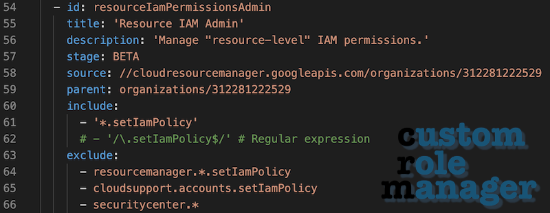

# Solutions portfolio

I've built several open sourced solutions. Have a look at what I've created and see if there's anything that
would work for you or your organization.

## Google Cloud Platform solutions

### Cloud Instance mapper

Cloud Instance mapper creates a score-based mapping of different cloud IaaS VM instance types from EC2 and Azure Compute to Google Cloud Platform instance types, based on fresh data fetched from APIs. You can also map AWS RDS instances to Google Cloud SQL database types.

[Link to repository](https://github.com/GoogleCloudPlatform/professional-services/tree/main/tools/instance_mapper)

### gcpviz

`gcpviz` is a visualization tool that takes input from [Cloud Asset Inventory](https://cloud.google.com/asset-inventory/docs/overview),
creates relationships between assets and outputs a format compatible with [`graphviz`](http://graphviz.gitlab.io/).

[Link to repository](https://github.com/GoogleCloudPlatform/professional-services/tree/main/tools/gcpviz)

### Pubsub2Inbox

Pubsub2Inbox is a swiss-army knife for reacting to Pub/Sub message. It can perform many different tasks, like
sending out emails using your own SMTP servers, copying files between buckets, running BigQuery queries, turning
single messages into multiple ones (fan out), etc.

[Link to repository](https://github.com/GoogleCloudPlatform/professional-services/tree/main/tools/pubsub2inbox)

### Custom Role Manager

Custom Role Manager is a tool that can be used to keep custom roles up to date. You can source permissions from either testable permissions 
of a resource or from another role or set of roles.

[Link to repository](https://github.com/GoogleCloudPlatform/professional-services/tree/main/tools/custom-role-manager)

### GCS2BQ

Collect all your Google Cloud Storage metadata from your organization and build storage dashboards.

[Link to repository](https://github.com/GoogleCloudPlatform/professional-services/tree/main/tools/gcs2bq)

### Per-user Metadata Proxy (to be published)

`per-user-metadata-proxy` is a proxy server that can provide separate Service Account identities for workloads 
running under different users on a single Compute Instance server. It uses the `/proc` filesystem's list of TCP 
connections to find the local identity of the workload and maps any gcloud/Cloud SDK/curl requests to another 
service account.

[Link to repository](https://github.com/rosmo/professional-services/tree/per-user-metadata-proxy/tools/per-user-metadata-proxy)

### gsnapshot

`gsnapshot` provides a more traditional experience in managing VM instance level snapshots, rollbacks
and commits.

[Link to repository]( https://github.com/GoogleCloudPlatform/professional-services/tree/main/tools/gsnapshot)

### pubsub2syslog

A very simple example of reading from Pub/Sub and writing the messages to syslog (can be used
for example to transport audit logs to security products that support reading syslog).

[Link to repository](https://github.com/rosmo/pubsub2syslog)

### Lambda compatibility for Cloud Run

Running unmodified AWS Lambda functions on Cloud Run? With credentials? It's possible by using
a Lambda Runtime API emulator written in Go.

[Link to repository](https://github.com/GoogleCloudPlatform/professional-services/tree/main/tools/lambda-compat)

## Google Cloud Platform examples

### Long running Cloud Run functions

Example on how to run long-running Cloud Run functions, with discussion on alternative approaches
and limitations.

[Link to article](https://taneli-leppa.medium.com/long-running-cloud-run-functions-e13b00ff9585)
[Link to repository](https://github.com/rosmo/long-cloud-run)

### Contributions

#### GKE Autoneg

Autoneg allows you to add Kubernetes services to Google Load Balancing backends.

[Link to repository](https://github.com/GoogleCloudPlatform/gke-autoneg-controller)

#### Gitlab installation using GCP load balancing

Uses Autoneg and GCP load balancing components to run a Gitlab installation through
external HTTP(S) load balancing and global TCP proxy for SSH.

[Link to repository](https://github.com/rosmo/terraform-google-gke-gitlab/tree/gclb-autoneg)

#### Cloud Foundation Fabric

This repository provides end-to-end examples and a suite of Terraform modules for Google Cloud
for rapid prototyping.

[Link to repository](https://github.com/GoogleCloudPlatform/cloud-foundation-fabric)

## Other solutions

### go-hidproxy

Proxies Bluetooth keyboards and mouse as HID devices

[Link to repository](https://github.com/rosmo/go-hidproxy)

### mydumper-anon

Anonymizes data dumps from MySQL instances in real-time.

[Link to repository](https://github.com/rosmo/mydumper-anon)

### Deterministic Random for JMeter

Creates randomness with a predefined seed for a JMeter run.

[Link to repository](https://github.com/rosmo/jmeter-plugins)

## Contributions to open source

Projects I've contributed to: [amitbet/vncproxy](https://github.com/amitbet/vncproxy), [noVNC/noVNC](https://github.com/novnc/noVNC),
[hashicorp/packer](https://github.com/hashicorp/packer), [ansible/ansible](https://github.com/ansible/ansible), [apache/beam](https://github.com/apache/beam),
[spotify/annoy](https://github.com/spotify/annoy), [terraform-google-modules/cloud-foundation-fabric](https://github.com/terraform-google-modules/cloud-foundation-fabric),
[terraform-google-modules/terraform-google-vpc-service-controls](https://github.com/terraform-google-modules/terraform-google-vpc-service-controls),
[GoogleCloudPlatform/policy-library](https://github.com/GoogleCloudPlatform/policy-library), [rocket-internet-berlin/RocketGoRedSVD](https://github.com/rocket-internet-berlin/RocketGoRedSVD),
[boto/boto](https://github.com/boto/boto), [wcgallego/pecl-gearman](https://github.com/wcgallego/pecl-gearman), [phpv8/v8js](https://github.com/phpv8/v8js),
[php/php-src](https://github.com/php/php-src), ...
